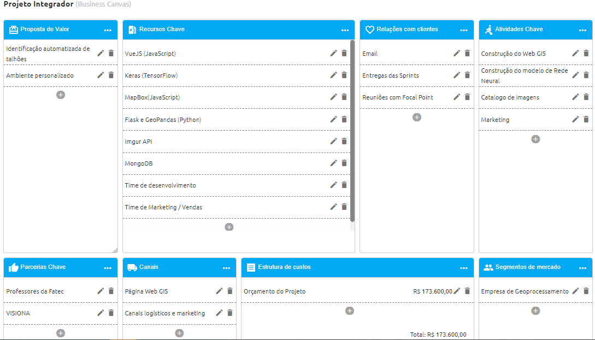

**Team Members**

- [ ] Bruno Ferro - PO
- [ ] Fabio Rodrigues - FullStack Developer
- [ ] Leonardo Tamanhão - IA Developer
- [ ] Luciano Cabral - Scrum Master
- [ ] Luis Belo - Web Developer
- [ ] Matheus Froes - Backend Developer

## What is this?

This project aims to create a plataform for analysis of satellite image by means of AI to
making it able to identify plots of land and provide a image catalog where the user can download
his research.

## Currently defined tools:

**[Imgur API](https://apidocs.imgur.com/?version=latest)** To store and provide images
for the WebGIS plataform.

**[MongoDB](https://docs.mongodb.com/manual//)** NoSQL Database to store users informations and
allowing requests queries to be run.

**[Keras](https://keras.io/) [Tensor Flow](https://www.tensorflow.org/)** Neural network
that will be the core of the project written in Python and capable of running on top of
TensorFlow.

**[WebGIS](http://www.webgis.com/) with [VueJS](https://vuejs.org/)** To develop the frontend 
of the platform.

**[Mapbox](https://www.mapbox.com/)** For the Map Tile Engine os the plataform.

**[Flask](https://palletsprojects.com/p/flask/)** and
**[GeoPandas](https://geopandas.org/)** To develop backend tools such as CRUD.

## Canvas of Project:

## Sprint 1:

**[Documentation](https://gitlab.com/projeto-integrador-fatec/documentation/-/tree/Sprint_1)** 
Link for the repository with the documents of this Sprint

**[Backlog](https://dev.azure.com/lucianocruz01/Projeto%20Integrador/_sprints/backlog/Projeto%20Integrador%20Team/Projeto%20Integrador/Sprint%201)** 
Link for the Azure DevOps Backlog of this Sprint

**[Burndown Trend](https://dev.azure.com/lucianocruz01/Projeto%20Integrador/_sprints/analytics/Projeto%20Integrador%20Team/Projeto%20Integrador/Sprint%201)** 
Link for the Azure DevOps Burndown Tred of this Sprint

## Sprint 2:

**[Documentation](https://gitlab.com/projeto-integrador-fatec/documentation/-/tree/Sprint_2)** 
Link for the repository with the documents of this Sprint

**[Backlog](https://dev.azure.com/lucianocruz01/Projeto%20Integrador/_sprints/backlog/Projeto%20Integrador%20Team/Projeto%20Integrador/Sprint%202)** 
Link for the Azure DevOps Backlog of this Sprint

**[Burndown Trend](https://dev.azure.com/lucianocruz01/Projeto%20Integrador/_sprints/analytics/Projeto%20Integrador%20Team/Projeto%20Integrador/Sprint%202)** 
Link for the Azure DevOps Burndown Tred of this Sprint

## Sprint 3:

**[Documentation](https://gitlab.com/projeto-integrador-fatec/documentation/-/tree/Sprint_3)** 
Link for the repository with the documents of this Sprint

**[Backlog](https://dev.azure.com/lucianocruz01/Projeto%20Integrador/_sprints/backlog/Projeto%20Integrador%20Team/Projeto%20Integrador/Sprint%203)** 
Link for the Azure DevOps Backlog of this Sprint

**[Burndown Trend](https://dev.azure.com/lucianocruz01/Projeto%20Integrador/_sprints/analytics/Projeto%20Integrador%20Team/Projeto%20Integrador/Sprint%203)** 
Link for the Azure DevOps Burndown Tred of this Sprint
